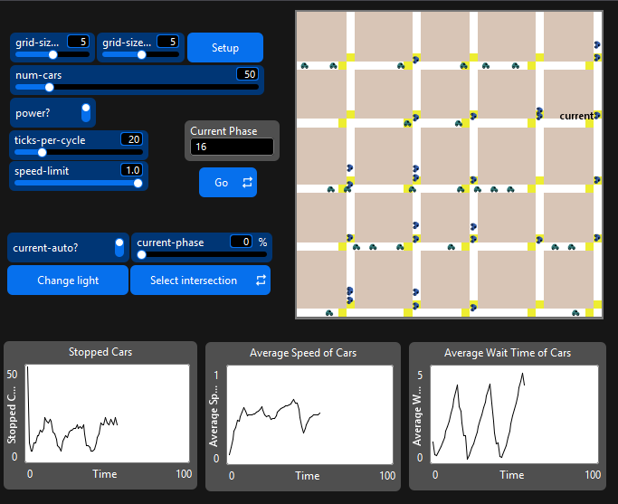
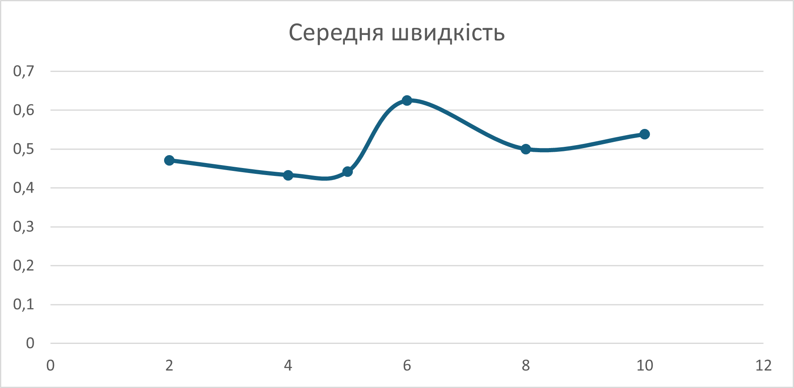

## Комп'ютерні системи імітаційного моделювання
## СПм-24-1, **Пермяков Владислав Андрійович**
### Лабораторна робота №**2**. Редагування імітаційних моделей у середовищі NetLogo

<br>

### Варіант 1, модель у середовищі NetLogo:
[Traffic Grid](https://www.netlogoweb.org/launch#http://www.netlogoweb.org/assets/modelslib/Sample%20Models/Social%20Science/Traffic%20Grid.nlogo)

<br>

### Внесені зміни у вихідну логіку моделі, за варіантом:

**Додано до моделі жовтий сигнал світлофора**, що робить її більш реалістичною та дозволяє автомобілям коректно реагувати на зміну сигналів.  
В моделі була створена додаткова глобальна змінні **yellow-duration** та **yellow-probability**
```netlogo
globals  
[  
  grid-x-inc  
  grid-y-inc  
  acceleration  
  phase  
  num-cars-stopped  
  current-light  
  
  intersections  
  roads  
  
  yellow-duration  ; змінна, що визначає тривалість жовтого кольору світлофора
  yellow-probability ; змінна, що визначає ймовірність руху водія на жовтий
]
```
Тривалість **yellow-duration** визначається параметром:
```netlogo
to setup-globals  
  set current-light nobody  
  set phase 0  
  set num-cars-stopped 0  
  set grid-x-inc world-width / grid-size-x  
  set grid-y-inc world-height / grid-size-y  
  set acceleration 0.099  
  set yellow-duration 5  ; визначення тривалості жовтого кольору світлофора
  set yellow-probability 0.3  ; визначення ймовірності руху авто на жовтий
end
</pre>
Також оновлена логіка перемикання кольорів світлофора:
<pre>
to set-signals  
  ask intersections with [auto?]  
  [  
    ; жовтий стан перед зміною зеленого  
    if (phase mod ticks-per-cycle = (ticks-per-cycle - yellow-duration))  
    [  
      set yellow-light? true  
      set-signal-colors  
    ]  
  
    ; переключення зеленого напрямку  
    if (phase mod ticks-per-cycle = 0)  
    [  
      set yellow-light? false  
      set green-light-up? not green-light-up?  
      set-signal-colors  
    ]  
  ]  
end
```
Оновлена функція візуальної зміни кольора світлофора:
```netlogo
to set-signal-colors  
  if yellow-light? [  
    ask patch-at -1 0 [ set pcolor yellow ]  
    ask patch-at 0 1 [ set pcolor yellow ]  
  ]  
  if not yellow-light? [  
    ifelse green-light-up?  
    [  
      ask patch-at -1 0 [ set pcolor red ]  
      ask patch-at 0 1 [ set pcolor green ]  
    ]  
    [  
      ask patch-at -1 0 [ set pcolor green ]  
      ask patch-at 0 1 [ set pcolor red ]  
    ]  
  ]  
end
```
### Внесені зміни у вихідну логіку моделі, на власний розсуд:

**Реалізовано поступове прискорення автомобілів після зміни сигналу.**  
Замість миттєвого переходу до максимальної швидкості, транспорт прискорюється із заданим коефіцієнтом:
```netlogo
to setup-globals  
  set current-light nobody  
  set phase 0  
  set num-cars-stopped 0  
  set grid-x-inc world-width / grid-size-x  
  set grid-y-inc world-height / grid-size-y  
  set acceleration 0.099  ; встановлення прискорення авто
  set yellow-duration 5  
  set yellow-probability 0.3  
end
```
**Додано зміну кольорів авто в залежності від їх швидкості**:
```netlogo
to set-car-color  
  ifelse speed < (speed-limit/2)  
  [ set color blue ]  
  [ set color cyan - 2 ]  
end
```




Фінальний код моделі та її інтерфейс доступні за [посиланням](Traffic-Grid.nlogox).
<br>
## Обчислювальні експерименти
### 1. Вплив тривалості жовтого сигналу на середню швидкість руху

Середня швидкість вимірювалась протягом 300 тіків виконання моделювання та з такими стартовими параметрами:

- grid-size-x=5
- grid-size-y=5
- num-cars=50
- ticks-per-cycle=20
- speed-limit=1.0

<table>
<thead>
<tr><th>Тривалість жовтого сигналу</th><th>Середня швидкість</th></tr>
</thead>
<tbody>
<tr><td>2</td><td>0.471</td></tr>
<tr><td>4</td><td>0.433</td></tr>
<tr><td>5</td><td>0.442</td></tr>
<tr><td>6</td><td>0.625</td></tr>
<tr><td>8</td><td>0.5</td></tr>
<tr><td>10</td><td>0.538</td></tr>
</tbody>
</table>

